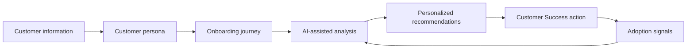

# Customer Learning Journey AI

An AI-assisted framework for turning customer insights into personalized onboarding and adoption journeys.

## Why I built this

Customer Success is not only about answering questions or solving problems. It is about understanding what customers need, identifying where they are getting stuck, and helping them move toward value.

With a background in education and over 20 years of experience designing personalized learning experiences, I wanted to explore how AI could be used to bring that same thinking into Customer Success.

This project connects three areas:

- Customer Success
- Learning & Enablement
- AI-assisted personalization

## The idea

The framework takes customer information such as:

- goals
- challenges
- level of familiarity with a product
- preferred learning format
- engagement signals

and uses AI to help transform those insights into a more personalized customer learning journey.

The goal is not to replace the Customer Success Manager.

The goal is to help the CSM think more strategically, identify patterns faster, and design better customer experiences at scale.

## How it works

The process is designed as an iterative customer learning journey: customer signals inform the next analysis and help the CSM adjust the experience over time.
## What this project demonstrates

This project is an exploration of how AI can support:

- Customer onboarding
- Customer education
- Product adoption
- Personalized enablement
- Customer engagement
- Scalable learning experiences

## My approach

I am approaching this project from a Customer Success and learning perspective rather than a purely technical one.

I am particularly interested in the intersection between **customer behavior, learning, communication, and technology**.

This project is part of my transition into Customer Success and AI-enabled customer experience.

## What I'm learning

Through this project, I am developing practical experience with:

- Generative AI
- Prompt design
- AI-assisted workflows
- Customer journey mapping
- Customer education
- Product adoption
- Translating customer insights into action

## Current project components

The project currently includes:

- A sample customer persona
- A customer onboarding journey
- An AI-assisted onboarding prompt
- A customer feedback analysis framework
- A customer health and adoption framework
- A Customer Success action plan

## Explore the project

The project includes the following components:

- [Customer Persona](examples/customer-persona.md) — defines the customer context, goals, challenges, and learning preferences.
- [Customer Onboarding Journey](examples/fitness-saas-onboarding.md) — maps the onboarding experience for a SaaS customer.
- [AI-Assisted Onboarding Prompt](examples/ai-prompt.md) — demonstrates how AI can support personalized onboarding recommendations.
- [Customer Feedback Analysis](customer-feedback-analysis.md) — analyzes customer feedback and identifies potential adoption barriers.
- [Customer Health & Adoption Framework](examples/customer-health-score.md) — provides a simple framework for monitoring customer health and adoption.
- [Customer Success Action Plan](examples/customer-success-action-plan.md) — translates customer insights into practical Customer Success actions.
- [Generic vs. Personalized Onboarding](examples/generic-vs-personalized-onboarding.md) — compares a standard onboarding approach with a personalized experience.
- [AI-Assisted Onboarding Output](examples/ai-onboarding-output.md) — demonstrates how customer inputs can be transformed into personalized onboarding recommendations.
  
- ## Future iterations

Future improvements may include:

- A comparison between generic and personalized onboarding experiences
- Additional customer scenarios
- Expanded AI-assisted recommendations
- More detailed customer health signals

---

**Created by Pâmela Vianna Torres**

Customer Success | Customer Education | AI-assisted Customer Experience
