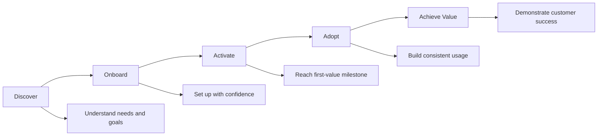

# Customer Journey Map

## From Onboarding to Adoption

This journey maps the customer experience from the moment they start onboarding to the point where they consistently use the product to achieve value.

## Journey Stages

| Stage | Customer Goal | Customer Signal | CS Action | Learning / Enablement | Success Signal |
|---|---|---|---|---|---|
| Discover | Understand whether the product fits their needs | Questions about use cases and capabilities | Clarify goals and expected outcomes | Provide relevant resources | Clear success criteria |
| Onboard | Get started with confidence | Initial setup activity | Guide implementation and remove friction | Role-based onboarding | Meaningful onboarding milestone |
| Activate | Experience the first value | Early feature usage | Identify blockers and reinforce workflows | Targeted guidance based on usage | First-value milestone reached |
| Adopt | Build consistent product usage | Increasing engagement | Encourage effective workflows and identify gaps | Ongoing enablement | Consistent usage aligned with goals |
| Achieve Value | Demonstrate business or customer value | Positive outcomes and continued adoption | Connect usage to desired outcomes | Advanced resources and best practices | Customer achieves intended value |

## Key Principle

The journey is not linear. Customer Success should use customer signals to identify friction, adapt the experience, and provide the right intervention at the right stage.
